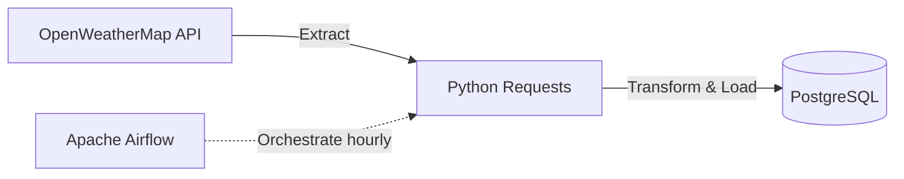

# Automated Weather Data Ingestion Pipeline (ETL)

A containerized ETL pipeline that extracts real-time weather data for Hanoi from the OpenWeatherMap API, processes/transforms the payload, and loads it into a PostgreSQL database. The workflow is orchestrated hourly using Apache Airflow.



---

## Features
- **Data Extraction**: Automated REST API ingestion using Python's `requests` library.
- **Workflow Orchestration**: Scheduled execution every hour using Apache Airflow DAGs with configured retries and error-handling.
- **Idempotent Storage**: Implements a PostgreSQL schema with `UPSERT` capabilities (`ON CONFLICT DO NOTHING` on unique `city` + `observation_time`) to prevent duplicate data insertion.
- **Containerized Infrastructure**: Fully packaged environment using Docker and Docker Compose for easy deployment and isolation.

---

## Directory Structure
```text
.
├── dags/
│   ├── airlfow.py       # Airflow DAG definition & configuration
│   ├── get_api.py       # API consumer for OpenWeatherMap
│   └── table.py         # Database connection, schema creation, & data ingestion
├── airflow_init.sql     # Database initialization script
├── docker-compose.yml   # Multi-container Docker configuration
└── README.md            # Project documentation
```

---

## Setup & Installation

### Prerequisites
- Docker & Docker Compose installed.
- An API Key from [OpenWeatherMap](https://openweathermap.org/api).

### Configuration
1. Open `dags/get_api.py` and replace the placeholder `api_key` with your OpenWeatherMap API key:
   ```python
   api_key = "YOUR_API_KEY_HERE"
   ```

2. (Optional) Check the PostgreSQL configurations in `docker-compose.yml`:
   - **Database User**: `postgres_user`
   - **Database Password**: `postgres_password`
   - **Database Name**: `database01`
   - **Exposed Port**: `5433` (maps to container port `5432`)

---

## Running the Project

1. **Spin up the containers**:
   Run the following command in the project root directory:
   ```bash
   docker compose up -d
   ```
   This will download the required images (PostgreSQL 16 Alpine, Apache Airflow 3.2.2) and launch the containers.

2. **Access Apache Airflow**:
   - Open your browser and navigate to `http://localhost:8000`.
   - The standalone version will automatically configure passwords, which are saved in the `passwords.json` file.

3. **Verify the Ingestion**:
   To check if data is being correctly inserted into PostgreSQL, execute `psql` within the database container:
   ```bash
   docker compose exec db psql -U postgres_user -d database01
   ```
   Run the SQL query to inspect the ingested data:
   ```sql
   SELECT * FROM p1.raw_weather_data;
   ```

---

## Database Schema
The pipeline writes to the `p1` schema inside `database01`:

| Column Name | Data Type | Constraints / Description |
|---|---|---|
| `id` | `SERIAL` | `PRIMARY KEY` |
| `city` | `TEXT` | Name of the city (e.g., Hanoi) |
| `temperature` | `FLOAT` | Temperature in Celsius |
| `weather_descriptions` | `TEXT` | Brief weather description |
| `wind_speed` | `FLOAT` | Wind speed in m/s |
| `observation_time` | `TIMESTAMP` | Time of weather observation |
| `inserted_at` | `TIMESTAMP` | Record insertion timestamp (Default: `NOW()`) |
| `utc_offset` | `TEXT` | UTC timezone offset (e.g., `+07:00`) |

*Constraint: `unique_city_time UNIQUE (city, observation_time)` prevents duplicate logs for the same city at the same observation hour.*
